# RA3G-Agent - Architecture Diagrams

## Table of Contents
1. [High-Level System Overview](#1-high-level-system-overview)
2. [Mid-Level Component Architecture](#2-mid-level-component-architecture)
3. [Low-Level Flow Diagrams](#3-low-level-flow-diagrams)
4. [Data Lineage](#4-data-lineage)
5. [Class Structure](#5-class-structure)
6. [Sequence Diagrams](#6-sequence-diagrams)

---

## 1. High-Level System Overview

### 1.1 Complete System Architecture

```mermaid
graph TD
    subgraph "User Interface"
        STREAMLIT[Streamlit Web UI]
        API_CLIENT[REST API Clients]
    end

    subgraph "API Layer"
        FASTAPI[FastAPI Server]
        HEALTH[/health Endpoint]
        QUERY[/query Endpoint]
        UPLOAD[/upload Endpoint]
    end

    subgraph "Multi-Agent System"
        RETRIEVER[Retriever Agent]
        REASONING[Reasoning Agent]
        GOVERNANCE[Governance Agent]
    end

    subgraph "RAG Pipeline"
        INDEXER[Document Indexer]
        VECTORDB[Vector Store]
        EMBEDDINGS[Embedding Model]
        LLM[Local LLM]
    end

    subgraph "Data Layer"
        DOCS[PDF Documents]
        LOGS[Session Logs]
        CONFIG[config.yml]
    end

    STREAMLIT --> FASTAPI
    API_CLIENT --> FASTAPI
    
    FASTAPI --> HEALTH
    FASTAPI --> QUERY
    FASTAPI --> UPLOAD
    
    QUERY --> RETRIEVER
    RETRIEVER --> REASONING
    REASONING --> GOVERNANCE
    
    RETRIEVER --> VECTORDB
    VECTORDB --> EMBEDDINGS
    REASONING --> LLM
    
    UPLOAD --> INDEXER
    INDEXER --> EMBEDDINGS
    EMBEDDINGS --> VECTORDB
    
    DOCS --> INDEXER
    CONFIG --> FASTAPI

    classDef ui fill:#e1f5fe
    classDef api fill:#fff3e0
    classDef agent fill:#e8f5e9
    classDef rag fill:#fce4ec
    classDef data fill:#f3e5f5
    
    class STREAMLIT,API_CLIENT ui
    class FASTAPI,HEALTH,QUERY,UPLOAD api
    class RETRIEVER,REASONING,GOVERNANCE agent
    class INDEXER,VECTORDB,EMBEDDINGS,LLM rag
    class DOCS,LOGS,CONFIG data
```

### 1.2 Simplified System Map

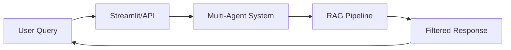

---

## 2. Mid-Level Component Architecture

### 2.1 Multi-Agent Pipeline

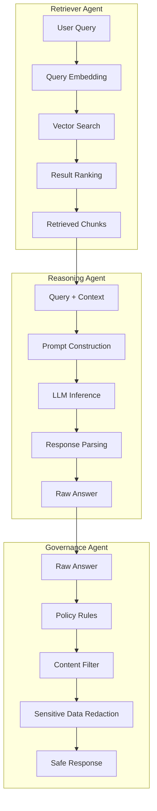

### 2.2 API Endpoints Structure

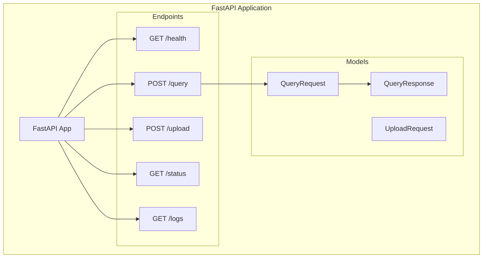

### 2.3 Document Processing Pipeline

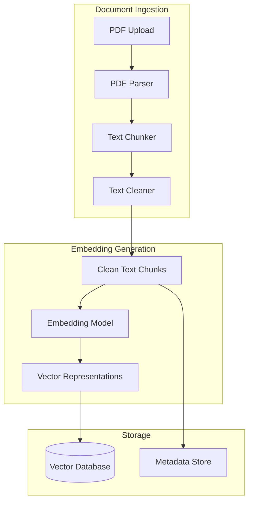

---

## 3. Low-Level Flow Diagrams

### 3.1 Query Processing Flow

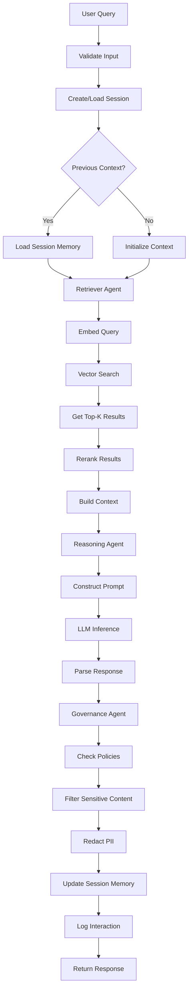

### 3.2 Document Indexing Flow

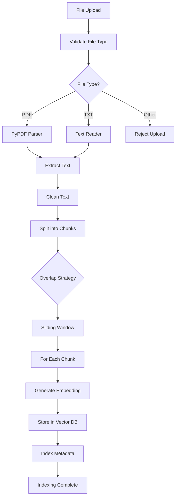

### 3.3 Governance Filter Flow

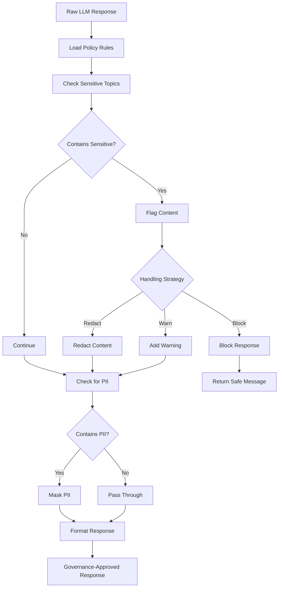

---

## 4. Data Lineage

### 4.1 Query Data Lineage

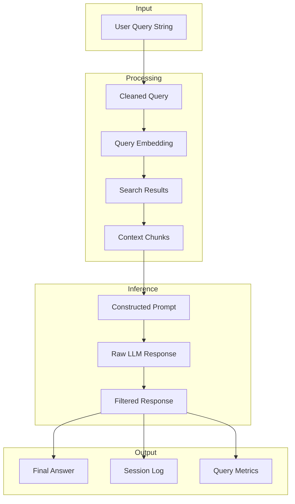

### 4.2 Document Data Lineage

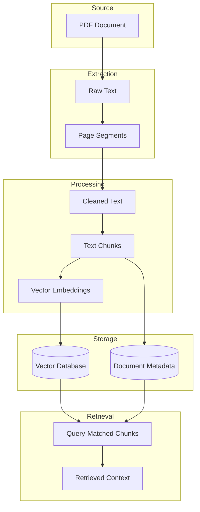

---

## 5. Class Structure

### 5.1 Core Components

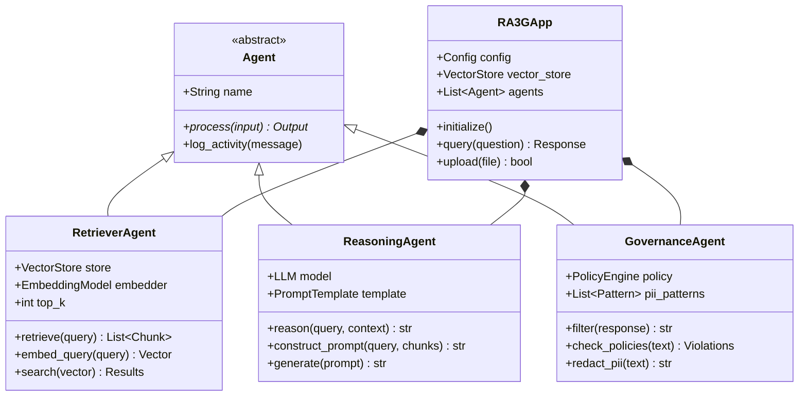

### 5.2 Data Models

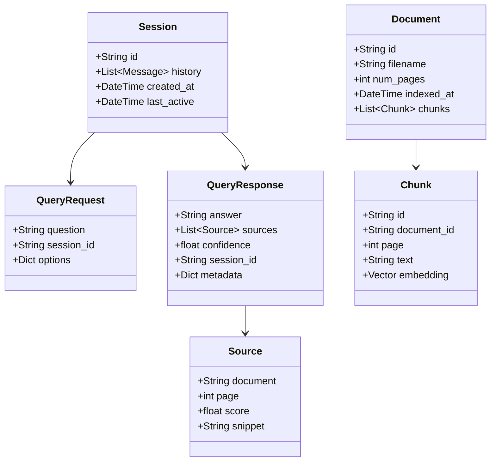

### 5.3 Policy Engine

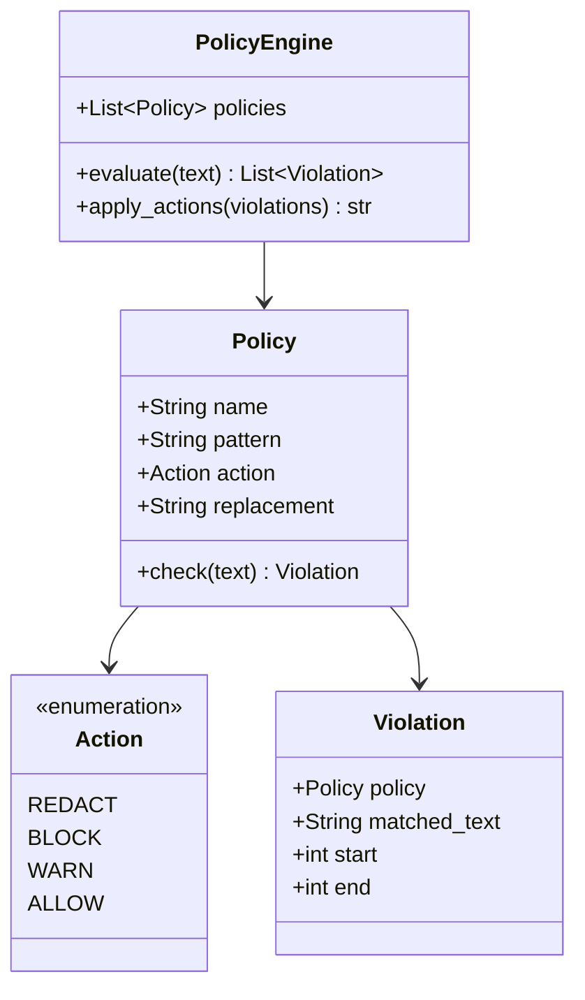

---

## 6. Sequence Diagrams

### 6.1 Query Processing Sequence

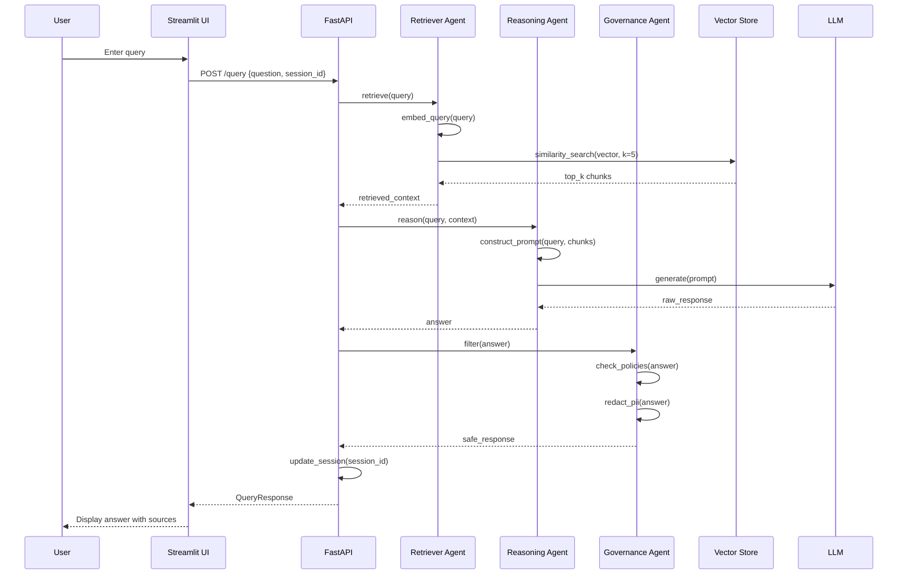

### 6.2 Document Upload Sequence

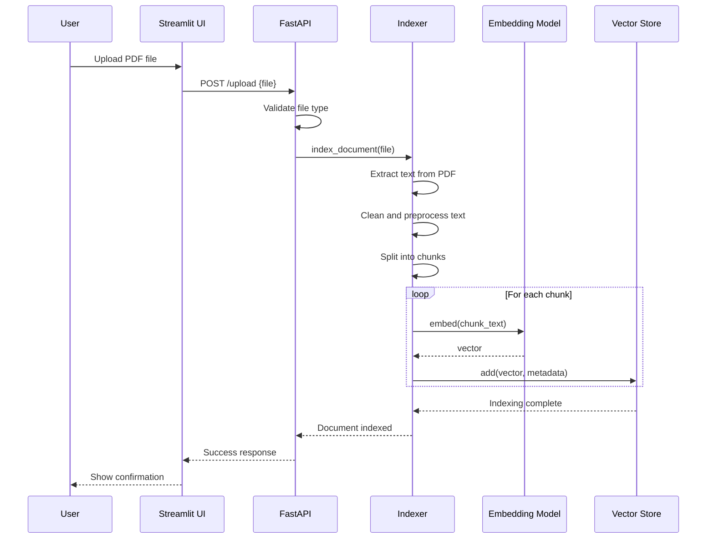

### 6.3 Session Memory Flow

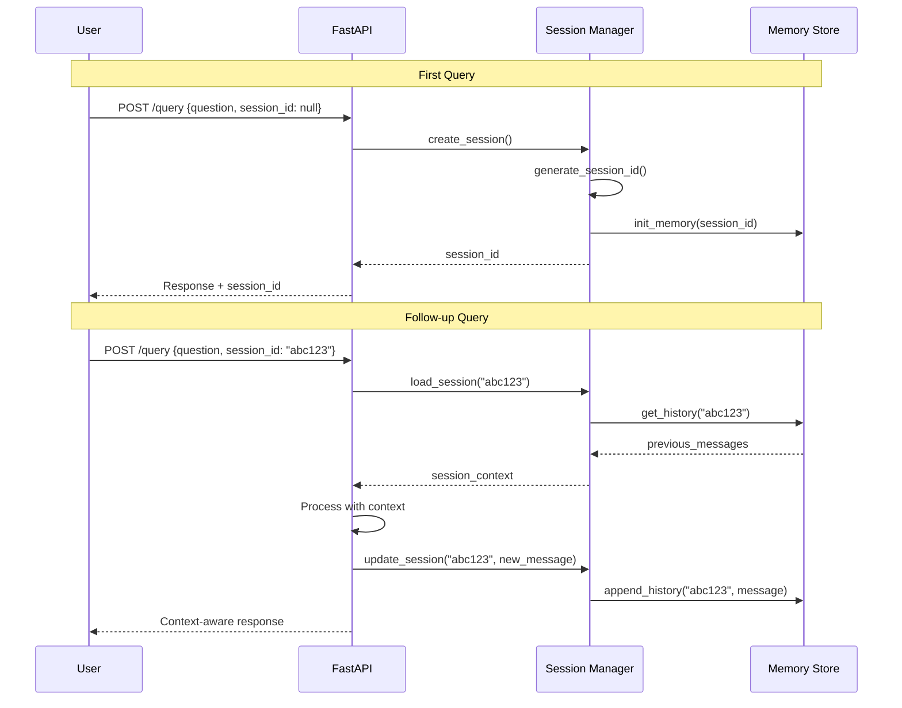

---

## 7. Unified System Map

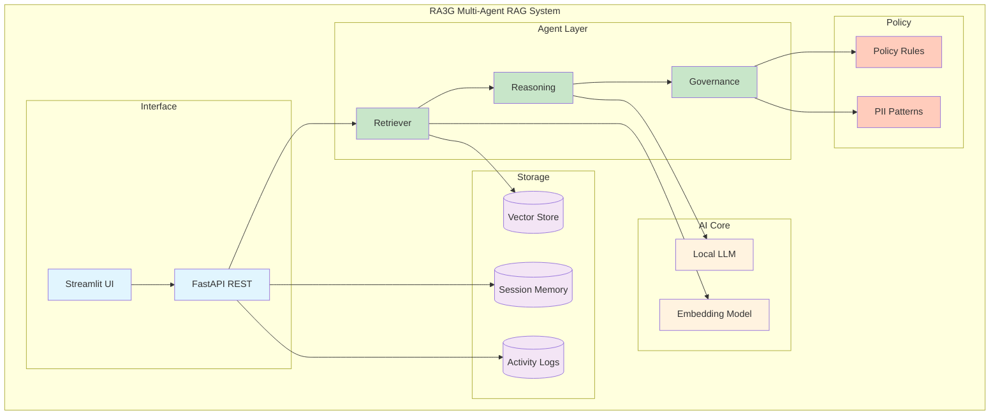

---

## Usage

View these diagrams in:
- GitHub/GitLab markdown preview
- VS Code with Mermaid extension
- [Mermaid Live Editor](https://mermaid.live/)
